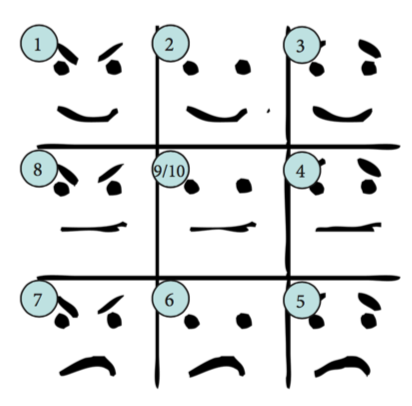
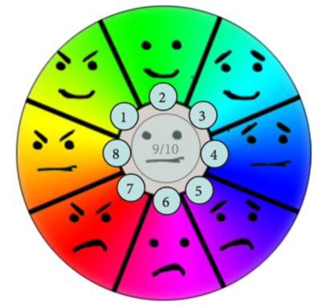
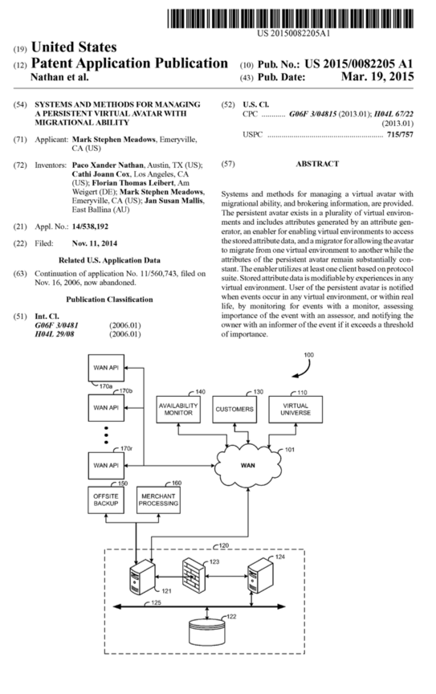
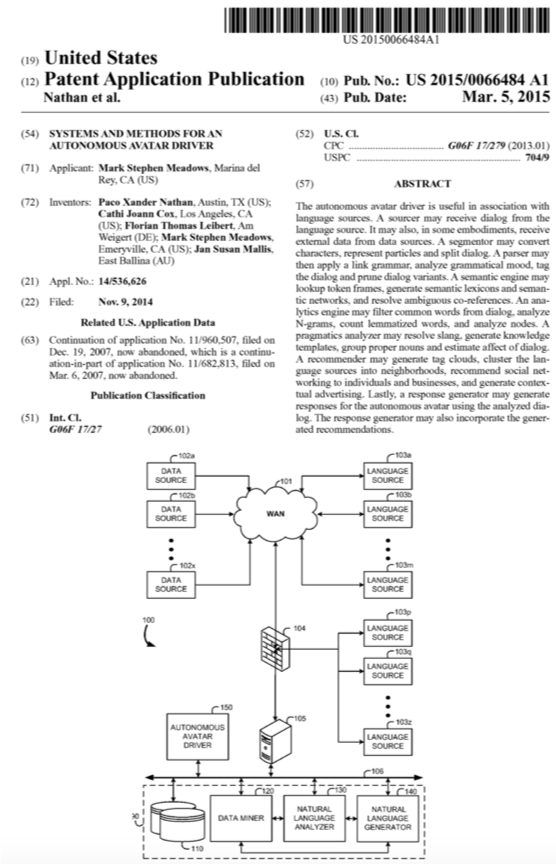

# ACTR: Autonomous Character & Topology Resource

## Animating Emotions by interpolating Fibonacci Chains and Iconic Gestures

### Function

To drive realtime animations that are contextually appropriate to arbitrary natural language input or output. This may include animating an avatar based on the output of a natural language processing system, driving a VR scenegraph via voice control, or other purposes. Ultimately, ACTR generates realtime cinema from natural language strings.  The following specifications detail animating avatars that are connected to chatbots.

### The library preparation

We began with a breakout of 8 emotions (though this number can be different it has been convenient for us) and a single, nul / non-emotion. For a very similar model see [Plutchik's wheel of emotions](https://en.wikipedia.org/wiki/Plutchik%252525252527s_Wheel_of_Emotions%25252523Plutchik.27s_wheel_of_emotions) (which doesn’t work as well for reasons beyond our scope in this explanation). We’ll call these “emotion buckets.” We do not name the emotions as it is both unimportant and can even be detrimental to the development process.





We then built eight 33-second animations. Each of the eight animations cor- responded to the list of eight emotions. Two nul / non-emotion animations of the same duration were made, giving us a total of ten animations. Each of the 33 second animations were split into a Fibonacci sequence (1, 1, 2, 3, 5, 8, and 13 second durations). These were saved for later use, intended as a li- brary for later real-time concatenation during the conversation with the avatar. The link animation is then assigned a name based on these values, something like d13_e7 for emotion number seven at 13 seconds. This is in- tended as a reference for the player to then interpolate with other anima- tions.

### The realtime operation

The NLP system produces a block of output text in human-readable format. In order to leverage the prepared ACTR library (above) we need a duration value and an affect value. Duration is the time it takes to speak that text and is calculated by assuming that one second equals 7 bytes. Second, the undetermined emotion (the affect or emotion of the output NLP text) is calculated by an external service (such as WordNet Affect, manually entered, or others) and the affect report is delivered to the PHP script that is monitoring MultiMedia tag generation. The script then pro- duces a control file that roughly matches that emotion and duration without having repeated animations happening adjacent to one another.

### Generating the Chain Animation

A block of output text is evaluated so as to determine two values
1. **The duration report**. Listed in seconds, this is based on the number of
bytes if using a TTS system, or recording length, or whatever to deter-
mine how long it takes to speak it.
2. **The affect report**. Listed as an integer from 1-10, to correspond with our
emotional model, that corresponds to the emotion number.
These two values are then used to determine the duration and emotion of the composed, or chained, animation. This chained animation is a sequence of the links mentioned above generated by interpolating between the end-val- ues and start-values of successive link animations.

- Note: This multimedia script simultaneously prevents recurring anima- tions. An example of what needs to be avoided is if we have two re- sponses that are each the same emotion and the same duration. So consider the possibility that the system produces a block of text that amounts to 9 seconds of emotion #2, then another block of text, on the subsequent output, that is also 9 seconds of emotion #2. We do not want the avatar to have precisely the same animation so the sys- tem might use 8+1/#2 to generate the first animation, but we do not want to run that same (8+1/#2) again, so we use instead anything but that. One option would then be 5+1+3/#2. This avoids repeats.

### Iconic Gestures

At particular moments that require particular emphasis we use Iconic Ges- tures to break this up and bring attention to the words being said such that the Iconic Gesture matches the duration and sentiment of what is being said. ACTR provides 50 default iconic gestures (see below) however there is a spectrum of integration / customisation which is usually gated by scope

### Notes

As well as driving the individual character animation ACTR may also be used:
- To drive the entire scene graph (sun rises, flowers bloom, etc)
- To drive camera direction (Whip-pan to CU, to Extreme CU, dolly etc). Used
in cinematic techniques, this is key to building affective relationships with protagonists of stories, or other characters framed by the camera.

| ACTR JSON Format Overview |
| --------------- |
|The ACTR JSON format is designed to allow the communication of avatar con- trol data to an ACTR capable client for the purpose of rendering synchronized mouth movement, emotional expression, and iconic gestures.<br><br>Required animations:<ul><li>for each of type = [head body]</li><li>10 emotions labeled 1 through 10, 9 and 10 are alternate neutrals</li><li>durations (in milliseconds) 1000a, 1000b, 2000, 3000, 5000, 8000, 13000 for each emotion (there are two with duration = 1000)</li><li> result is 70 animations each for head and body</li><li>labels in the model are {type}_e{emotion}_d{duration} or iconic_{name} _d{duration}</li><li>e.g. head_e4_d1000a, body_e5_d2000, iconic_cheers_d4000 - standard iconics are: thumbsup, onethumbup, cheers, wave, etc</li><li>visemes</li><li>fall under "mouth" label</li><li>all characters must have a neutral mouth (e.g. mouth_neutral_d500)</li><li>all viseme animations are 500ms long with peak shape at 250ms to allow animation blending</li><li>each language will have a standard minimum set of visemes with its own phoneme to viseme mapping</li></ul> |

| Base English language visemes |
| --------------- |
| o [o]<br>a [a]<br>c [cdgknrsy]<br>e [e]<br>f [fv]<br>m [m]<br>u [u]<br>neutral|

| Other details |
| --------------- |
|<ul><li>each sequence is targeted to a specific scene element (i.e. character name)</li><li>each sequence is a combination of speech elements with head and body emotion animations</li><li>all the animations will be presented to fill the total duration</li><li>all sequences delivered in the same server response have the same start time</li><li>sequences with a start_delay must have their playback delayed by the indicated amount</li><li>speech visemes and entries playback is always synchronized</li><li>phoneme string is rendered in the International Phonetic Alphabet (http://en.wikipedia.org/wiki/International_Phonetic_Alphabet). See http://upodn.com/phon.asp for example transcodings.</li><li>viseme string is mapping of phoneme to available viseme animations</li><li>entries of different types (e.g. body and head) in the entries array are ren- dered in synchronization, according to order, from the start time |

#### Elements

```
{ "sequence": {
	"element": string,		//name of the scene element that is
					// the target of this sequence
	"start_delay": integer,		//start time delay from "0" for this se-quence(millisecs)
	"total_duration": integer,	//duration of all animations together (mil-liseconds)
	"speech": string,		//Human readable speech text
	"phoneme": string,		//International Phonetic Alphabet version of speech
	"visemes": array of strings,	//array of viseme animation names 
					//mapped by server from phonemes
	"entries: [			//array of animation entries
		{
			"type": string,		//entry type [head|body|iconic]
			"label": string,	//label used in the model
			"description": string,	//human readable helper description
			"duration": float,	//duration of this entry in sec-onds.
			"order": integer,	//playback order of this entry 
						//(preserved within type)
			"info": {			//non-common fields, custom per type
				"type": string,		//should match parent type
				"emotion": string,	//emotion label, typically 1 through 10
				"duration": string, 	//duration label 
							// [1000a,1000b,2000,3000,5000,8000,13000]
				"mouth": float,		//used for custom mixing of mouth varia-ble
				"eyes": float		//used for custom mixing of eye variable
			}
		}
	]
	}
}
```

### Full list of ACTR animations

Full list of ACTR animations

 * The character should be split into multiple FBX files per markup on the list
 * Each FBX file MUST use the same RIG
 * Each FBX file should contain one animation clip per named animation assigned to it
 * It is preferred that the animations are not set to have one keyframe per frame

 * durations are in milliseconds
 * @ 24 frames per second, the here are the mappings:
   * 500ms   = 12F
   * 1000ms  = 24F
   * 2000ms  = 48F
   * 3000ms  = 72F
   * 4000ms  = 96F
   * 5000ms  = 120F
   * 8000ms  = 192F
   * 13000ms = 312F

Mouth entries are so short that ACTR will just use LERP to transition between them.

Emotions are defined according to the emotion wheel (see related image file). 
For head, emotions are essentially the various combinations of smile/frown with eyebrows up/down.

Here are the names of the emotions to map to the numbers 

e1 - Mischievous<br />
e2 - Happy<br />
e3 - Kind/Sympathetic<br />
e4 - Worried/Uncertain<br />
e5 - Sad/Hurt<br />
e6 - Disapproving/Disappointed<br />
e7 - Angry<br />
e8 - Determined<br />
e9,10 - Neutral<br />

Here is the full set of categories:
e1,e2,e3,e4,e5,e6,e7,e8,e9,admiring,encouraging,appreciative,congratulatory,positive,cheers,wave,hello,goodbye,thumbsup,onethumbup,pout

NLP can send comma-delimited sets of the categories to be played back and ACTR will generate a playlist of the according length combining the different cat-egories.

e.g. affect=thumbsup,e2

Head emotions should also include blinking, etc.
For body, emotions should include hand gestures, breathing, etc.

Neutral emotions e9 and e10 will be "loopable" on the base neutral keyframe and so do not need transitions. Transitions to emotions and transitions from emotions must be played before each emotion animation sequence. This is true for both head emotion tracks and body emotion tracks.

Head and body for a given emotion will start and end in the "emotion" state and so are loopable, but they require a transition to emotion animation and transition from emotion 
animation to be played before a given emotion sequence is played.

Iconics are also loopable, starting and ending on the "neutral" keyframe to avoid the need for specific iconic transition animations.


**BELOW IS THE FULL SET OF EMOTION ANIMATIONS AND TRANSITIONS IN ORDER OF IM-PLEMENTATION PRIORITY.**

Please NOTE the naming convention for the A and B variants on the 1 second ver-sions of each emotion.

Please NOTE the markup indicating which FBX file should contain the animation.

<mouth_and_iconic.FBX>

mouth_o_d500
mouth_a_d500
mouth_c_d500
mouth_e_d500
mouth_f_d500
mouth_m_d500
mouth_u_d500
mouth_neutral_d500

</mouth_and_iconic.FBX>

<e9.FBX>

head_e9-A_d1000
head_e9-B_d1000
head_e9_d2000
head_e9_d3000
head_e9_d5000
head_e9_d8000
head_e9_d13000

body_e9-A_d1000
body_e9-B_d1000
body_e9_d2000
body_e9_d3000
body_e9_d5000
body_e9_d8000
body_e9_d13000

</e9.FBX>

<e2.FBX>

head_transition-to-e2_d500
head_transition-from-e2_d500
body_transition-to-e2_d500
body_transition-from-e2_d500

head_e2-A_d1000
head_e2-B_d1000
head_e2_d2000
head_e2_d3000
head_e2_d5000
head_e2_d8000
head_e2_d13000

body_e2-A_d1000
body_e2-B_d1000
body_e2_d2000
body_e2_d3000
body_e2_d5000
body_e2_d8000
body_e2_d13000

</e2.FBX>

<e10.FBX>

head_e10-A_d1000
head_e10-B_d1000
head_e10_d2000
head_e10_d3000
head_e10_d5000
head_e10_d8000
head_e10_d13000

body_e10-A_d1000
body_e10-B_d1000
body_e10_d2000
body_e10_d3000
body_e10_d5000
body_e10_d8000
body_e10_d13000

</e10.FBX>

<e3.FBX>

head_transition-to-e3_d500
head_transition-from-e3_d500
body_transition-to-e3_d500
body_transition-from-e3_d500

head_e3-A_d1000
head_e3-B_d1000
head_e3_d2000
head_e3_d3000
head_e3_d5000
head_e3_d8000
head_e3_d13000

body_e3-A_d1000
body_e3-B_d1000
body_e3_d2000
body_e3_d3000
body_e3_d5000
body_e3_d8000
body_e3_d13000

</e3.FBX>

<e4.FBX>

head_transition-to-e4_d500
head_transition-from-e4_d500
body_transition-to-e4_d500
body_transition-from-e4_d500

head_e4-A_d1000
head_e4-B_d1000
head_e4_d2000
head_e4_d3000
head_e4_d5000
head_e4_d8000
head_e4_d13000

body_e4-A_d1000
body_e4-B_d1000
body_e4_d2000
body_e4_d3000
body_e4_d5000
body_e4_d8000
body_e4_d13000

</e4.FBX>

<mouth_and_iconic.FBX>

iconic_admiring-A_d1000
iconic_admiring-A_d2000
iconic_admiring-A_d3000
iconic_admiring-A_d4000
iconic_admiring-A_d5000
iconic_encouraging-A_d1000
iconic_encouraging-A_d2000
iconic_encouraging-A_d3000
iconic_encouraging-A_d4000
iconic_encouraging-A_d5000
iconic_appreciative-A_d1000
iconic_appreciative-A_d2000
iconic_appreciative-A_d3000
iconic_appreciative-A_d4000
iconic_appreciative-A_d5000
iconic_congratulatory-A_d1000
iconic_congratulatory-A_d2000
iconic_congratulatory-A_d3000
iconic_congratulatory-A_d4000
iconic_congratulatory-A_d5000
iconic_positive-A_d1000
iconic_positive-A_d2000
iconic_positive-A_d3000
iconic_positive-A_d4000
iconic_positive-A_d5000

</mouth_and_iconic.FBX>

<e6.FBX>

head_transition-to-e6_d500
head_transition-from-e6_d500
body_transition-to-e6_d500
body_transition-from-e6_d500

head_e6-A_d1000
head_e6-B_d1000
head_e6_d2000
head_e6_d3000
head_e6_d5000
head_e6_d8000
head_e6_d13000

body_e6-A_d1000
body_e6-B_d1000
body_e6_d2000
body_e6_d3000
body_e6_d5000
body_e6_d8000
body_e6_d13000

</e6.FBX>

<e5.FBX>

head_transition-to-e5_d500
head_transition-from-e5_d500
body_transition-to-e5_d500
body_transition-from-e5_d500

head_e5-A_d1000
head_e5-B_d1000
head_e5_d2000
head_e5_d3000
head_e5_d5000
head_e5_d8000
head_e5_d13000

body_e5-A_d1000
body_e5-B_d1000
body_e5_d2000
body_e5_d3000
body_e5_d5000
body_e5_d8000
body_e5_d13000

</e5.FBX>

<e1.FBX>

head_transition-to-e1_d500
head_transition-from-e1_d500
body_transition-to-e1_d500
body_transition-from-e1_d500

head_e1-A_d1000
head_e1-B_d1000
head_e1_d2000
head_e1_d3000
head_e1_d5000
head_e1_d8000
head_e1_d13000

body_e1-A_d1000
body_e1-B_d1000
body_e1_d2000
body_e1_d3000
body_e1_d5000
body_e1_d8000
body_e1_d13000

</e1.FBX>

<e8.FBX>

head_transition-to-e8_d500
head_transition-from-e9_d500
body_transition-to-e8_d500
body_transition-from-e9_d500

head_e8-A_d1000
head_e8-B_d1000
head_e8_d2000
head_e8_d3000
head_e8_d5000
head_e8_d8000
head_e8_d13000

body_e8-A_d1000
body_e8-B_d1000
body_e8_d2000
body_e8_d3000
body_e8_d5000
body_e8_d8000
body_e8_d13000

</e8.FBX>

<e7.FBX>

head_transition-to-e7_d500
head_transition-from-e7_d500
body_transition-to-e7_d500
body_transition-from-e7_d500

head_e7-A_d1000
head_e7-B_d1000
head_e7_d2000
head_e7_d3000
head_e7_d5000
head_e7_d8000
head_e7_d13000

body_e7-A_d1000
body_e7-B_d1000
body_e7_d2000
body_e7_d3000
body_e7_d5000
body_e7_d8000
body_e7_d13000

<mouth_and_iconic.FBX>

iconic_cheers_d3000
iconic_wave_d3000
iconic_hello_d3000
iconic_goodbye_d3000
iconic_thumbsup_d3000
iconic_onethumbup_d3000
iconic_pout_d3000

</mouth_and_iconic.FBX>

### Iconic Gestures (Default List)

//Iconics are also loopable, starting and ending on the "neutral" keyframe to avoid the
//need for specific iconic transition animations
iconic_cheers_d1000
iconic_wave_d1000 iconic_hello_d1000 iconic_goodbye_d1000 iconic_thumbsup_d1000 iconic_onethumbup_d1000 iconic_pout_d1000

| # |User Says<br />(NLP_IN) | Gesture Description | Gesture Name / ID |
| --- | ---- | --- | --- |
|1| | (idiosyncratic) | iconic_interestedA_d1000|
|2| | (idiosyncratic) | iconic_interestedB_d2000|
|3| | (idiosyncratic) | iconic_interestedC_d3000|
|4| | (idiosyncratic) | iconic_interestedD_d4000|
|5| | (idiosyncratic) | iconic_interestedE_d5000|
|6| | head cocked to left | iconic_thinkingA_d1000|
|7| | chin raised, eyes narrowed | iconic_thinkingB_d2000|
|8| | chin lowered, looks at user | iconic_thinkingC_d3000|
|9| | holds chin in right hand, folds left arm across abdomen | iconic_thinkingD_d4000|
|10| | rests chin on right fist, folds left arm across abdomen | iconic_thinkingE_d5000|
|11| | Eyes widen/eyebrows raise | iconic_surprisedA_d1000|
|12| | (idiosyncratic) | iconic_surprisedB_d2000|
|13| | (idiosyncratic) | iconic_surprisedC_d3000|
|14| | (idiosyncratic) | iconic_surprisedD_d4000|
|15| | (idiosyncratic) | iconic_surprisedE_d5000|
|16| | Right finger to chin | iconic_listeningA_d1000|
|17| | Right finger to right cheek | iconic_listeningB_d2000|
|18| | Eyes squint, nod | iconic_listeningC_d3000|
|19| | one eyebrow raised | iconic_listeningD_d4000|
|20| | head cocked to right | iconic_listeningE_d5000|
|21| | Puts hands behind body and nods head | iconic_concernedA_d1000|
|22| | Cocks head, chin moving to left, and furrows forehead | iconic_concernedB_d2000|
|23| | Holds chin in left hand, folds right arm across abdomen, left elbow resting on top of right hand | iconic_concernedC_d3000|
|24| | Places left palm across left cheek, folds right arm across abdomen | iconic_concernedD_d4000|
|25| | Jut chin forward and up, furrow brow | iconic_concernedE_d5000|


Prioritisation (top ten in order of most useful down with an evenly scattered range of duration)
1. iconic_listeningA_d1000
2. iconic_listeningB_d2000
3. iconic_listeningC_d3000
4. iconic_listeningD_d4000
5. iconic_listeningE_d5000
6. iconic_thinkingA_d1000
7. iconic_thinkingB_d2000
8. iconic_thinkingC_d3000
9. iconic_thinkingD_d4000
10. iconic_thinkingE_d5000

| #| Bot Says (NLP_OUT)	| Gesture Description | Gesture Name |
| --- | --- | --- | --- |
|1| | Eyebrows raise, small smile | iconic_admiringA_d1000|
|2| | Smile, nod head | iconic_admiringB_d2000|
|3| | Eyebrows raise, head swivel so that chin moves down and to the left (head cock) | iconic_admiringC_d3000|
|4| | Holds up right hand index finger, points at user (You!) | iconic_admiringD_d4000|
|5| | Thumbs up, right hand	iconic_admiringE_d5000|
|6| | (idiosyncratic) | iconic_encouragingA_d1000|
|7| | (idiosyncratic) | iconic_encouragingB_d2000|
|8| | (idiosyncratic) | iconic_encouragingC_d3000|
|9| | Nods head | iconic_encouragingD_d4000|
|10| | Folds hands in front of body and nods head | iconic_encouragingE_d5000|
|11| | Thumbs up, right hand | iconic_appreciativeA_d1000|
|12| | OK sign, right hand | iconic_appreciativeB_d2000|
|13| |  (idiosyncratic) | iconic_appreciativeC_d3000|
|14| | (idiosyncratic) | iconic_appreciativeD_d4000|
|15| | (idiosyncratic) | iconic_appreciativeE_d5000|
|16| | Thumbs up | iconic_congratulatoryA_d1000|
|17| | Smile, thumbs up | iconic_congratulatoryB_d2000|
|18| | Claps (five beats) | iconic_congratulatoryC_d3000|
|19| | Nod, smile, thumbs up | iconic_congratulatoryD_d4000|
|20| | Fist pump in the air, smile | iconic_congratulatoryE_d5000|
|21| | Nod head | iconic_positiveA_d1000|
|22| | Close eyes, nod head two beats, open eyes | iconic_positiveB_d2000|
|23| | (idiosyncratic) | iconic_positiveC_d3000|
|24| | (idiosyncratic) | iconic_positiveD_d4000|
|25| | (idiosyncratic) | iconic_positiveE_d5000|


Prioritisation (top ten in order of most useful down with a mostly-evenly scat-tered range of duration)

1. iconic_admiringA_d1000
2. iconic_admiringB_d2000
3. iconic_admiringC_d3000
4. iconic_admiringD_d4000
5. iconic_admiringE_d5000
6. iconic_appreciativeA_d1000
7. iconic_appreciativeB_d2000
8. iconic_positiveA_d1000
9. iconic_positiveB_d2000
10 iconic_encouragingD_d4000

## Miscellaneous Notes 

###Prioritization of Affect
In 100 outputs the avatar will be neutral (#9 & #10) and happy (#2) the majority of the time. Generally speaking the left side of the chart is less commonly used, so the avatar is rarely seen with its eyebrows down, and even less commonly seen with both eyebrows and mouth down. 

| Group | Prio |
| --- | --- |
|#9 | 20% |
|#2 | 20% |
|#10 | 20% = 60% of animations |
|#3 | 12% |
|#4 | 9% |
|#6 | 6% |
|#5 | 6% |
|#1 | 3% |
|#8 | 2% |
|#7 | 2% |

## Disclaimer

These files are made available to you on an as-is and restricted basis, and may only be redistributed or sold to any third party as expressly indicated in the Terms of Use for Seed Vault.


## APPENDIX I 

Patents and related intellectual property (full applications available upon request)

*SYSTEMS AND METHODS FOR AN AUTONOMOUS AVATAR DRIVER;*
- Application #14/536,626
- Means of using NLP and identification methods to provide a visual representa-tion of an avatar to talk and perform in-world (virtual) functions.

*SYSTEMS AND METHODS FOR CINEMATIC DIRECTION AND DYNAMIC CHARACTER CON-TROL VIA NATURAL LANGUAGE OUTPUT*
- Application #15/49,164
- Driving realtime 3D graphics with linguistic (NLG) output, this is a method of turn-ing text into a cinematic sequence of animations, such as animating an avatar and an associated scenegraph.





Seed Vault Code (c) Botanic Technologies, Inc. Used under license.